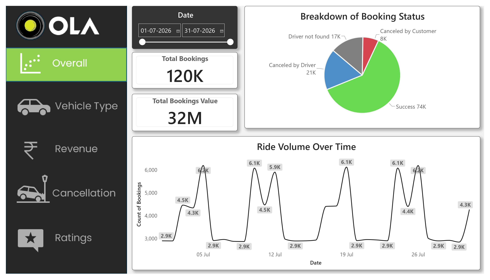
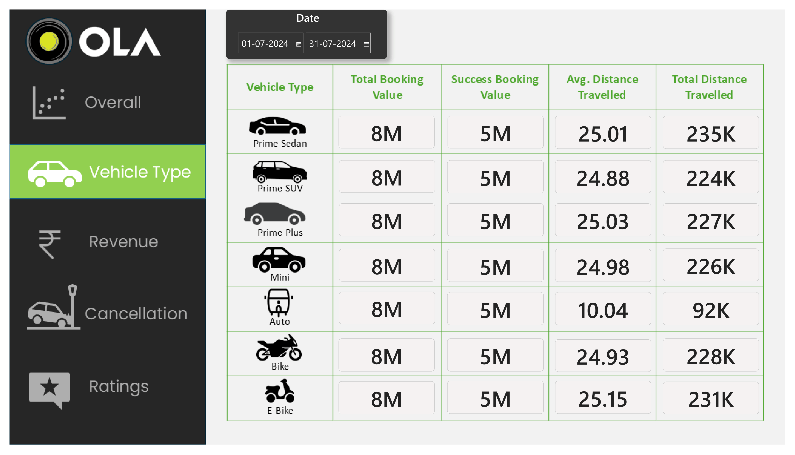
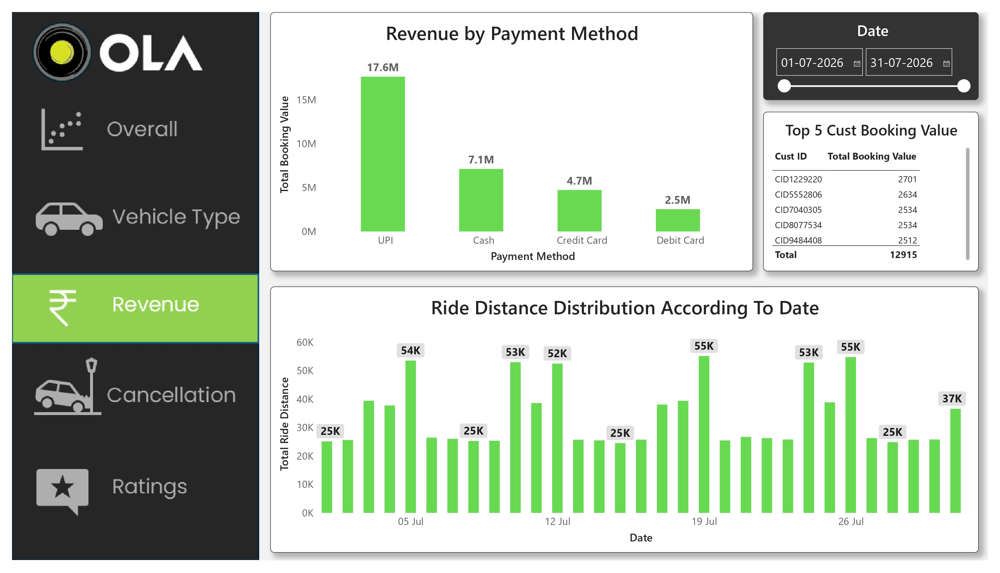
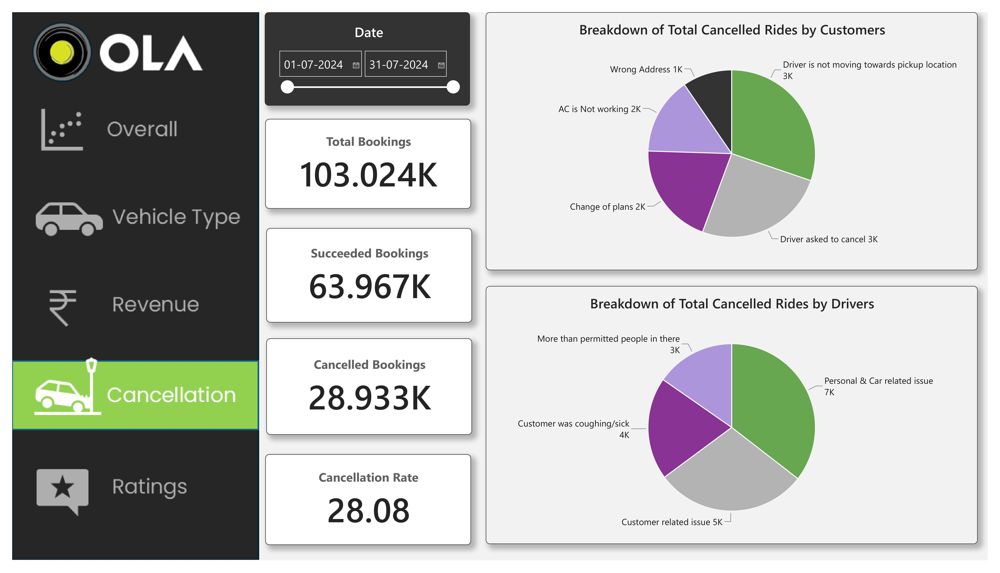
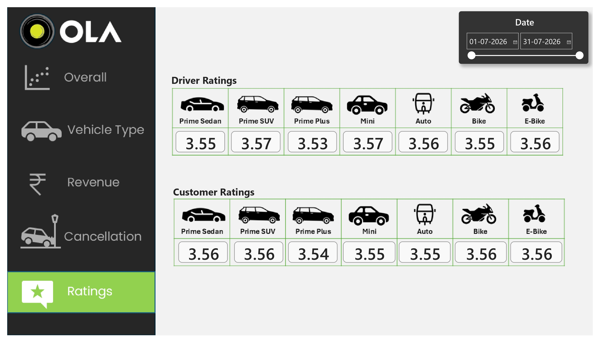

# 🚖 OLA Data Analytics End-to-End Project

An end-to-end **Data Analytics** project built using **SQL Server, Excel, and Power BI** to analyse ride booking data from OLA. This project focuses on solving real-world business problems by transforming raw booking data into meaningful insights through SQL analysis and interactive dashboards.

The project demonstrates the complete analytics workflow—from data preparation and SQL querying to dashboard development and business insight generation.

---

# 📌 Project Overview

Ride-hailing platforms generate thousands of bookings every day. Understanding booking trends, customer behaviour, revenue, cancellations, and ratings is essential for improving operational efficiency and customer satisfaction.

In this project, I analysed **120K ride bookings** using SQL Server and Power BI. Business questions were answered through SQL queries and reusable SQL Views, while Power BI dashboards were designed to visualise key performance indicators and operational metrics.

This project analyses a historical OLA ride-booking dataset covering 1 July 2026 to 31 July 2026. Using SQL Server, Excel, and Power BI, I explored booking trends, revenue, cancellations, customer behaviour, and vehicle performance to build an interactive analytics dashboard.

---

# ⭐ Project Summary

### Situation
Analysed over 100K OLA ride bookings to understand business performance, customer behaviour, and operational efficiency.

### Task
Developed an end-to-end analytics solution using SQL Server and Power BI to answer business questions and visualise key metrics.

### Action
- Wrote SQL queries and created reusable SQL Views.
- Performed data cleaning and validation.
- Built a five-page interactive Power BI dashboard.
- Created KPIs for bookings, revenue, cancellations, vehicle performance, and ratings.

### Solution Delivered

Developed an interactive Power BI dashboard that enables users to analyse booking performance, revenue, ride cancellations, payment methods, customer behaviour, vehicle performance, and ratings through dynamic visualisations and filters.

---

# 🎯 Project Objectives

The primary objectives of this project are:

- Analyse ride booking data using SQL Server
- Answer business questions using SQL queries and Views
- Perform data cleaning and validation
- Build interactive Power BI dashboards
- Monitor KPIs related to bookings, revenue, cancellations, and ratings
- Generate actionable business insights from ride booking data

---

# 🛠️ Tech Stack

| Tool | Purpose |
|------|----------|
| Microsoft SQL Server | Data Analysis & SQL Queries |
| SQL | Business Querying & Views |
| Microsoft Excel | Data Cleaning & Validation |
| Power BI | Dashboard & Visualization |
| Git & GitHub | Version Control |

---

## 📊 Dataset Information

| Attribute | Details |
|-----------|----------|
| Dataset | OLA Ride Bookings |
| Time Period | **1 July 2026 – 31 July 2026** |
| Records | **120,000** |
| Columns | **19** |
| Format | CSV |
| Size | ~120K ride bookings |

### Dataset Columns

- Date
- Time
- Booking ID
- Booking Status
- Customer ID
- Vehicle Type
- Pickup Location
- Drop Location
- Vehicle TAT
- Customer TAT
- Cancelled by Customer
- Cancelled by Driver
- Incomplete Rides
- Incomplete Ride Reason
- Booking Value
- Payment Method
- Ride Distance
- Driver Rating
- Customer Rating

---

# 📈 Business Requirements

The project was designed to analyse the following business scenarios:

- Booking success rate
- Ride cancellation trends
- Revenue analysis
- Vehicle performance
- Customer booking behaviour
- Driver performance
- Customer satisfaction
- Payment method preferences

---

# 🗄️ SQL Analysis

The following business questions were solved using SQL Server.

| No | Business Question |
|----|-------------------|
| 1 | Retrieve all successful bookings |
| 2 | Calculate average ride distance for each vehicle type |
| 3 | Count rides cancelled by customers |
| 4 | Identify the Top 5 customers based on total rides |
| 5 | Count rides cancelled by drivers due to personal/car issues |
| 6 | Find the maximum and minimum driver ratings for Prime Sedan |
| 7 | Retrieve all UPI payment bookings |
| 8 | Calculate average customer rating for each vehicle |
| 9 | Calculate total booking value of successful rides |
|10| Retrieve incomplete rides along with reasons |

---

# 📊 Power BI Dashboard

The Power BI dashboard consists of **5 interactive report pages**.

---

## 1️⃣ Overall Dashboard

Provides an overall business summary including:

- Total Bookings
- Total Booking Value
- Ride Volume Over Time
- Booking Status Distribution
- Interactive Date Filter

---

## 2️⃣ Vehicle Type Dashboard

Compares different vehicle categories based on:

- Total Booking Value
- Successful Booking Value
- Average Ride Distance
- Total Distance Travelled

---

## 3️⃣ Revenue Dashboard

Analyses revenue performance using:

- Revenue by Payment Method
- Top 5 Customers by Booking Value
- Ride Distance Distribution

---

## 4️⃣ Cancellation Dashboard

Analyses ride cancellation patterns.

Includes:

- Customer Cancellation Reasons
- Driver Cancellation Reasons
- Cancellation Rate
- Successful Bookings
- Cancelled Bookings

---

# 📸 Project Walkthrough

## Step 1: Raw Dataset

[Dataset]([https://github.com/Jayesh8946/OLA-Data-Analytics-Project/tree/main/Dataset](https://github.com/Jayesh8946/OLA-Data-Analytics-Project/tree/main/Dataset))

---

## Step 2: SQL Analysis

[SQL]([https://docs.github.com/](https://github.com/Jayesh8946/OLA-Data-Analytics-Project/tree/main/Dataset)](https://github.com/Jayesh8946/OLA-Data-Analytics-Project/tree/main/SQL)

---

## Step 3: Power BI Dashboard

### Overall Dashboard


### Vehicle Analysis


### Revenue Analysis


### Cancellation Analysis


### Ratings Analysis


---

# 🔍 Key Business Insights

Some insights obtained from the analysis include:

- Most ride bookings were completed successfully.
- Cash and UPI were the most preferred payment methods.
- Prime vehicle categories generated the highest booking revenue.
- Cancellation reasons differed significantly between customers and drivers.
- Driver and customer ratings remained consistently around **4.0** across vehicle types.
- Ride demand remained relatively stable throughout the month with noticeable daily fluctuations.

---

# 📂 Repository Structure

```
OLA-Data-Analytics-End-to-End-Project/

│
├── Dataset/
│   └── Bookings.csv
│
├── SQL/
│   └── Ola_SQL_Analysis.sql
│
├── Dashboard/
│   ├── Overall.png
│   ├── Vehicle_Type.png
│   ├── Revenue.png
│   ├── Cancellation.png
│   └── Ratings.png
│
├── PowerBI/
│   └── Ola_Dashboard.pbix
│
├── README.md
├── LICENSE
└── .gitignore
```

---

# 🔄 Project Workflow

```
Raw CSV Dataset
        │
        ▼
Data Cleaning (Excel)
        │
        ▼
SQL Server
        │
        ▼
Business Queries
        │
        ▼
SQL Views
        │
        ▼
Power BI Dashboard
        │
        ▼
Business Insights
```

---

# 💡 Skills Demonstrated

### SQL

- SQL Queries
- SQL Views
- Aggregations
- Filtering
- Sorting
- Business Analysis

### Power BI

- Dashboard Design
- KPI Cards
- Pie Charts
- Line Charts
- Bar Charts
- Interactive Filters
- Data Visualization

### Excel

- Data Cleaning
- Data Validation
- Data Formatting

---

# 🎓 Learning Outcomes

Through this project, I strengthened my understanding of:

- SQL-based business analysis
- Writing reusable SQL Views
- Data cleaning and validation
- Interactive Power BI dashboard development
- KPI design and reporting
- Business storytelling with data
- End-to-end analytics workflow

---

# 🚀 Future Improvements

Possible enhancements for this project include:

- Add DAX measures for advanced KPI calculations
- Build predictive analytics using Python
- Integrate live SQL Server database connectivity
- Publish dashboard to Power BI Service
- Add Row-Level Security (RLS)
- Automate data refresh

---

# 🙏 Acknowledgements

This project was completed as a hands-on analytics exercise inspired by a Data Analytics learning project. The implementation, SQL solutions, dashboard design, and documentation were developed independently to strengthen practical skills in SQL, Power BI, and business analytics.

---

# 👨‍💻 About Me

I'm an aspiring **Data Analyst** passionate about SQL, Power BI, Business Intelligence, and Data Visualization.

I enjoy building real-world analytics projects that transform raw data into meaningful business insights and continuously improve my problem-solving and analytical skills.

If you found this project useful, feel free to ⭐ the repository.
